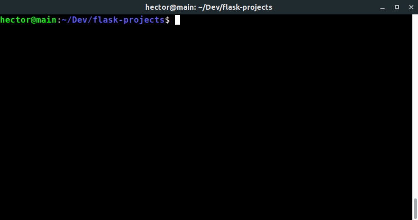

# flask-init

flask-init is a simple utility to initialize Flask projects structure, with one command.

## Installation

### From GitHub

1. **Check out flask-init where you want it installed.**
   A good place to choose is `$HOME/.flask-init`.

        $ git clone https://github.com/ulacioh/flask-init.git ~/.flask-init

2. **Add `$HOME/.flask-init/bin` to your `$PATH`** for access to the `flask-init` command-line utility.

   - For **bash**:
     ~~~ bash
     $ echo 'export PATH="$HOME/.flask-init/bin:$PATH"' >> ~/.bash_profile
     ~~~

   - For **Ubuntu Desktop**:
     ~~~ bash
     $ echo 'export PATH="$HOME/.flask-init/bin:$PATH"' >> ~/.bashrc
     ~~~

   - For **zsh**:
     ~~~ zsh
     $ echo 'export PATH="$HOME/.flask-init/bin:$PATH"' >> ~/.zshrc
     ~~~

## License

[The MIT License](LICENSE)
